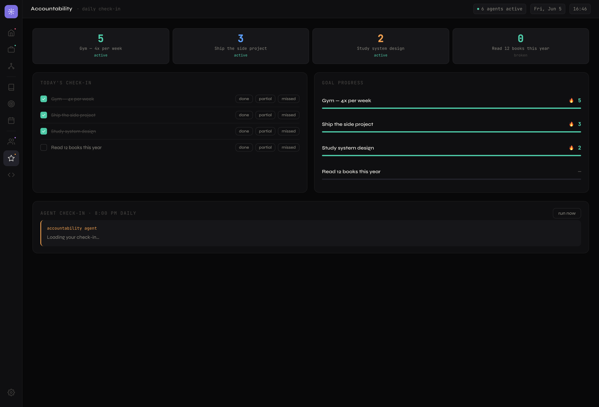

# Nexus

*A local-first personal AI operating system — six specialized agents that share one memory.*

> **Nexus runs entirely on your machine.** Six specialized AI agents share one brain — a single SQLite file holding your notes, goals, journal, jobs, inbox, and projects — so each agent can act on what the others know. An interview email doesn't just get flagged; it moves your job application to "interviewing." A commit doesn't just get logged; it becomes a node in your knowledge graph.

The shared context **is** the product. Most AI assistants are a handful of disconnected chatbots; Nexus is a set of agents reading and writing the same memory.

### What it does for you

- **Command center** — one home dashboard with live stats, every agent's status, and a merged activity feed across all of them.
- **Job matching** — pulls live listings and ranks them against your résumé with Claude.
- **Inbox triage** (read-only) — flags what's urgent, pulls deadlines onto your calendar, and updates job statuses when a recruiter writes back.
- **Second brain** — journal entries, notes, and research are auto-tagged and linked into a force-graph; shared tags become the edges, and an optional hierarchy (concepts → children) adds directional structure.
- **Research agent** — a chat-based research interface; explore a topic (paste articles, fetch URLs, ask questions), then distill the whole session into one permanent structured knowledge node.
- **Council of 5** — five AI personas debate your decisions and rants, challenge each other, and land on a consensus.
- **Accountability** — tracks goals, maintains streaks, and sends a nightly streak-aware nudge.
- **Morning brief** — learns your interests from your own notes (and tags you set) and curates a short daily news read.
- **Project archivist** — watches your repos and turns commits into plain-English memory and graph nodes.
- **Observability & cost** — every agent run and every Claude call is instrumented; a Settings panel shows per-agent run history, surfaced errors, next scheduled run, and estimated spend per agent and per day.

**Local-only by design.** Nexus runs on `localhost`, is never exposed publicly, and ships as a repo you clone and point at your own API keys. Filesystem and inbox access are exactly why it stays on your machine.

**Status:** Phases 1–7 complete — all six agents are built and running on schedule, with a cross-agent command center on top. Gmail and NewsAPI are wired in, and each agent degrades gracefully without its key. See [Roadmap](#roadmap).

## The dashboard, screen by screen

Nexus is one SPA with a left rail of tabs. Each tab is a window onto one or more agents writing to the shared `nexus.db` — so what you see in one screen is often the product of another agent's work. Here is every screen and what runs behind it.

> The screenshots below use seeded demo data (fictional companies, generic journal entries) — not real personal data.

### Home — the command center

The morning digest, and the one screen that shows the whole system working together. It reads from a single `/api/overview` endpoint that aggregates across **every** agent's table in one shot:

- **Live stat cards** — strong job matches, urgent emails, your best active streak, upcoming deadlines. Each card links straight to its tab.
- **Agents panel** — all six agents with a real-time status line (`12 listings tracked`, `7 triaged · 1 urgent`, `watching 1 repo · 3 changes`) and a health dot (active / idle / needs-attention). Click any row to jump to that agent's view.
- **Agent feed** — a merged, reverse-chronological stream of what every agent has been doing: a brief curated, an email flagged, the council weighing in, the archivist recording commits. This is the cross-agent picture nothing else gives you.
- **Morning brief** read and a **goals snapshot** with streak bars.


### Job board — the job agent

Live listings fetched from Adzuna / The Muse / Jobicy, scored 0–100 against your `.tex` résumés by Claude, and rendered from SQLite. Two subtabs split the board: **Found by agent** (everything scored) and **Live applications** (a tracker of the ones you're pursuing). A combinable filter bar covers track (DA/SWE), level (entry/mid/senior), status, city, and a match-score floor (70/80/85%+), with sort by newest, match score, or company; companies with 5+ listings collapse into one expandable row, and results paginate 50 at a time. Click any row to open an **inline detail panel** — an AI-written role summary, key responsibilities, how it aligns with your strengths, honest positives/negatives, missing skills, an estimated salary, the posting date, and a link to the listing. Mark a role **Applied** (or set any status: interested / interviewing / offer / rejected / withdrawn / archived) right from the panel or tracker. The **run now** button triggers the whole fetch → score → save pipeline on demand (it also runs on a 3-day cron, and the backend re-runs it on boot if the last scan is over 72h old). Untouched listings older than 30 days are auto-retired, while anything you've applied to or touched is kept forever; a separate lifetime "seen" count survives the cleanup. **Cross-agent:** the email agent writes back here — when a recruiter emails, a row's status flips to `interviewing` without you touching it.


### Second brain — the knowledge graph

Every note (journal entry, research node, or an archivist's commit summary) is a **node**; any two notes that share a tag get an **edge**. The result is a force-directed graph (`react-force-graph-2d`) you can pan, zoom, and click to preview a node. Untagged notes show dim; well-connected themes cluster. On top of that flat, associative web sits an optional **hierarchy**: *concept* nodes are organizational anchors ("Interview Prep", "Projects") and any note can be filed under one, creating **directed parent→child edges** (drawn with arrows) that are distinct from the undirected tag edges. The flat layer is pure Zettelkasten; the hierarchy makes it navigable. This is the "nervous system" the council and morning brief read from.


### Research — chat that becomes knowledge

A chat-based research interface. Open a session on a topic, then have a real conversation — **paste articles, fetch a URL, ask follow-ups, go down rabbit holes**. The raw conversation is ephemeral working memory. When you're done, hit **save session** and the agent reads the *entire* conversation and distills it into one permanent, structured knowledge node: a topic, a summary of what you learned, key concepts (which become its tags), conclusions, the **open questions** that came up but went unanswered (tracked over time), and the sources used. You can file the node under a concept on save, so it joins the hierarchy. This is the system's richest source of new nodes — and the foundation of the eventual "Ask Nexus anything" query layer over everything you've learned.


### Journal — free writing, auto-organized

Write a free-form entry and save it. On save, the **tagging agent** reads the text and returns two to four topic tags, which immediately appear on the entry and wire it into the second-brain graph. Recent entries are listed alongside the editor. You are never asked to file or categorize anything — the structure forms itself.


### Goals — what you're working toward

Create goals with a cadence (daily or weekly) and an optional target and category. Each goal shows a **streak momentum bar** (current streak relative to your best). Goals are read by two other agents: the **accountability agent** (for nudges and streak tracking) and the **morning brief** (your goal categories become news interests). Add a goal here and the Accountability tab and Home snapshot light up.


### Calendar — email triage and deadlines (the email agent)

The read-only **email agent** scans your Gmail inbox on a daily cron (and on demand via **scan inbox**), and this screen surfaces its work two ways:

- **Upcoming** — calendar events, including deadlines the agent *extracted from your emails* ("Application due Friday" becomes an event traced back to the source message), color-coded by who created them (you / email / job agent).
- **Inbox, triaged** — every scanned email tagged with an importance badge (`urgent` / `important` / `normal` / `noise`) and a category, plus a badge when the agent took a cross-agent action (for example `job → interviewing`).

Importance, deadlines, and job-status inference are all classified by Claude in a single batched call per run. Scope stays `gmail.readonly` — Nexus **never** sends or deletes.


### Council of 5 — perspective on demand

Ask about a decision, a situation, or just rant. Five personas — **Marcus** (the Stoic / control), **Lyra** (the Visionary / long arc), **Zeno** (Devil's Advocate / blind spots), **Aria** (the Empath / emotional truth), and **Rex** (the Pragmatist / next step) — answer in parallel, then each sees the others and responds again, declaring a stance (agrees / neutral / challenges). A cheap Haiku call scores overall consensus from 0 to 100, shown on a meter. The council reads your recent journal and active goals as cached context, so its advice is grounded in your actual life. Each session persists and replays on revisit.


### Accountability — streaks and nudges (the accountability agent)

Streak cards for your top goals, a today's check-in list (mark each goal `done` / `partial` / `missed`), and compact progress bars. Streaks are a cache **rebuilt from your check-in history** — a missed day or a gap correctly resets the live count. Nightly at 8pm (and via **run now**) the agent refreshes every streak and writes one warm, streak-aware nudge with Claude, grounded in your goals and recent journal.



### Projects — the archivist

Per-repo cards with an AI-written change log. The **project archivist** polls `git log` every 30 minutes (and watches each repo's `.git/logs/HEAD` for instant scans), summarizes each new commit with Claude into a `{summary, why, impact}` record, and — crucially — turns every change into a **tagged node in the second-brain graph**, so your project history connects to your journal themes by shared tags. Filesystem reach is sandboxed to the paths in `WATCHED_PROJECTS`; it touches nothing else.


### Behind the scenes — the tagging agent

Not a tab, but the connective tissue of the whole system. The **tagging agent** (`agents/tagAgent.js`) runs whenever a note is created — a journal entry on save, or an archivist commit summary. It is given the note text *and the list of tags already in your second brain*, and told to **reuse an existing tag whenever one fits** before inventing a new one. That reuse is what keeps the graph connected instead of fragmenting into one-off tags, and it is why a commit about the council feature can end up edge-connected to a journal entry about your career. It degrades gracefully with no API key — the note still saves, just untagged.

### Settings — observability, cost, and agent steering

Six agents run unattended on cron schedules, so the system needs to be observable. Every agent run and every Claude call is instrumented through a single wrapper, and this panel surfaces it:

- **Per-agent run history** — when each agent last ran, the trigger (cron / manual / on-demand), success or failure, a one-line summary of what it did, and the **next scheduled run** (computed from each agent's cron expression).
- **Cost tracking** — token usage is captured on every call and priced from published per-model rates, rolled up as **estimated spend per agent, today's total, and a daily trend**. A council question costs ~11 calls; now you can see exactly what each agent costs.
- **Error log** — failed runs surface here with their message, so a silent 6am failure is no longer invisible.
- **Agent steering** — clickable interest tags that direct the morning brief's news search (`world cup`, `AI research`, …) without editing any config file. The agent merges your picks with what it learns from your journal.


> **Engineering note (the part a reviewer might care about):** the observability layer is a single instrumented Claude client (`agents/claudeClient.js`) that every agent routes through. It brackets each run in an `agent_runs` row and logs token counts + estimated cost to `agent_usage`, all best-effort so telemetry can never break an agent. A read-only `GET /api/observability` aggregates last/next run, errors, and cost rollups in one query. It's LLM cost-and-reliability telemetry for a fleet of scheduled agents — built the way you'd want production AI infrastructure to work, at personal scale.

---

## Architecture

Two processes on one machine, both local:

- **Frontend** — Vite + React 18 SPA on `http://localhost:5173`. A thin client that calls the backend's REST API; it never touches the database or external APIs directly.
- **Backend** — a single long-running Express process on `http://localhost:3001`. Hosts the REST API, every agent, all schedulers (`node-cron`), and file watchers. This is the piece that runs 24/7.
- **Database** — SQLite (`better-sqlite3`), one file at `server/db/nexus.db`. The shared context layer every agent reads and writes.

```
                          ┌──────────────────────────┐
   Gmail (read-only) ───▶ │                          │ ───▶ Job board status flips
   Job boards ──────────▶ │      nexus.db            │ ───▶ Calendar deadlines
   Your journal/notes ──▶ │  (shared context layer)  │ ───▶ Second-brain graph
   Your goals ──────────▶ │                          │ ───▶ Morning brief interests
   Your git repos ──────▶ │   every agent r/w here   │ ───▶ Council & nudge context
                          └──────────────────────────┘
```

### How the agents work together (the whole point)

Because every agent reads and writes the same `nexus.db`, work flows between them automatically:

- **Email → Jobs.** A recruiter emails "let's schedule your interview" → the email agent matches the company to an application and flips `jobs.status` to `interviewing`. You never touch the board.
- **Email → Calendar.** "Application due Friday" in an email → a deadline event appears on your calendar, traced back to the source email.
- **Journal → Brief & Council.** Your journal tags ("career", "health") teach the morning brief what news to curate, and the council reads recent entries to ground its advice in what you're actually going through.
- **Archivist → Second brain.** Each commit becomes a tagged graph node, so your project history connects to your journal themes by shared tags.
- **Everything → Home.** The command-center dashboard aggregates all of it into one live cross-agent feed.

The frontend never touches the DB or external APIs directly — every read and write goes through the Express backend, so the agents stay the single source of truth.

---

## Prerequisites

- **Node.js 18+** (the backend uses the global `fetch`; tested on Node 20/22/24).
- **npm**.
- An **Anthropic API key** (required for any agent that reasons).
- Per-agent API keys as you enable each agent (see [Configuration](#configuration)).

---

## Install

The repo is one project with the backend nested under `server/` — two `package.json` files.

```bash
# from the repo root (the frontend)
npm install

# the backend
cd server && npm install && cd ..
```

---

## Configuration

All secrets live in `server/.env` (gitignored — never commit it). Copy the example and fill it in:

```bash
cp server/.env.example server/.env
```

What each value is and how to get it:

| Variable | Needed for | How to get it |
|---|---|---|
| `ANTHROPIC_API_KEY` | **All agents** (required now) | [console.anthropic.com](https://console.anthropic.com) → API keys → Create key. Add billing. ~$10–15/mo for personal daily use with prompt caching. |
| `ADZUNA_APP_ID` + `ADZUNA_APP_KEY` | **Job agent** (required now) | [developer.adzuna.com](https://developer.adzuna.com) → register → free tier (250 req/day). The Muse + Jobicy need no key. |
| `EMAIL_USER` + `EMAIL_APP_PASSWORD` + `EMAIL_RECIPIENT` | **Job report email** (optional — the run still works without it) | Gmail → [myaccount.google.com/apppasswords](https://myaccount.google.com/apppasswords) → generate a 16-char app password (requires 2FA). Used by Nodemailer to send the digest. |
| **Gmail OAuth** (`credentials.json`) | Email agent (Phase 5) | Google Cloud Console → new project → enable Gmail API → OAuth consent screen (External, add yourself as a test user) → create **OAuth Desktop** credentials → download `credentials.json` into `server/`. Then run once: `cd server && npm run gmail:auth` → open the printed URL, approve, paste the code back (token caches to `server/gmail-token.json`). Scope stays `gmail.readonly` — the agent never sends or deletes. |
| `NEWS_API_KEY` | Morning brief agent (Phase 5) | [newsapi.org](https://newsapi.org) free dev tier (or GNews/Currents). |
| `WATCHED_PROJECTS` | Project archivist (Phase 6) | Absolute local folder paths in `server/config.js`, e.g. `[{ name, path, type }]`. Not a credential — disk paths the watcher reads. Sandboxed to these paths only. |

For Phase 2 (the Job board) you only need `ANTHROPIC_API_KEY` and the two `ADZUNA_*` keys; email is optional.

---

## Run

Start both processes (two terminals). The backend must stay running for cron and watchers.

```bash
# terminal 1 — backend (port 3001)
cd server && npm run dev      # or: npm start

# terminal 2 — frontend (port 5173)
npm run dev
```

Open **http://localhost:5173**. The Vite dev server proxies `/api` to the backend, so the browser talks to one origin.

### Using the Job board

- The board renders live from SQLite across two subtabs (**Found by agent** / **Live applications**), with combinable filters (track, level, status, city, match-score floor), sort (newest / match / company), company grouping for 5+ listings, and 50-per-page pagination.
- Click a row to expand its **detail panel** (AI role summary, responsibilities, strength alignment, positives/negatives, missing skills, salary estimate, posted date, listing link). Use **Mark as Applied** or the status control to track an application; the email agent can also flip these statuses automatically.
- **`↻ run now`** triggers the full pipeline on demand: fetch live listings (Adzuna/Jobicy/The Muse) → score against your résumé with Claude → write to SQLite → optional email digest. The button polls progress and the board refreshes when the run finishes.
- The same pipeline runs automatically on a **`node-cron` schedule (`0 7 */3 * *`** — 07:00 every 3rd day), registered when the backend boots, **and on boot if the last scan is older than `JOB_AGENT_CATCHUP_HOURS` (72h)**. Each run also purges *untouched* listings older than 30 days — anything you've applied to or manually set is kept, and a lifetime "seen" count persists independently of the live board.

### Résumés and search settings

Search terms, target cities, scoring thresholds, the cron schedule, and résumé paths live in **`server/config.js`**. The scorer compares listings against the `.tex` résumés in `server/resumes/` (DA and SWE tracks) — **add your own there; they're gitignored so personal résumés never get committed.** Edit `config.js` to change what gets searched and which résumé scores each track.

### Maintenance scripts (run from `server/`)

```bash
npm run purge:jobs                 # delete only untouched found jobs (status=new, no application) older than 30 days
npm run purge:jobs -- --dry-run    # preview the purge
npm run migrate:jobs /path/to/jobs.json   # one-time import of a legacy job-agent jobs.json
```

---

## The agents

| Agent | Status | What it does |
|---|---|---|
| **Job agent** | Live (Phase 2) | Fetches + scores listings, writes to `jobs`, sends a 3-day email report. Runs on cron + the manual button. |
| **Email agent** | Built (Phase 5) | Reads Gmail (read-only), classifies importance, extracts deadlines into the calendar, and auto-updates `jobs.status` by matching companies. Needs a one-time `npm run gmail:auth`; no-ops gracefully until then. |
| **Council of 5** | Live (Phase 4) | Five personas (Marcus/Lyra/Zeno/Aria/Rex) answer in parallel, challenge each other, and a consensus score is computed. Reads journal + goals. Persona prompts are v1 to refine. |
| **Accountability** | Built (Phase 5) | Tracks goals, maintains streaks (cache rebuilt from check-in history), and sends a nightly streak-aware nudge. Verified live. |
| **Morning brief** | Built (Phase 5) | Learns your interests from the second brain (note tags + goals) and user-set steering tags, fetches NewsAPI, and condenses ~6 stories into a morning read. Needs a real `NEWS_API_KEY`. |
| **Project archivist** | Built (Phase 6) | Watches your code dirs, summarizes each commit with Claude into `project_changes` + a tagged second-brain graph node. Sandboxed to `WATCHED_PROJECTS`. Verified on this repo. |
| **Tagging agent** | Live (Phase 3) | Behind-the-scenes: auto-tags every new note, reusing existing tags so the graph stays connected. |
| **Research agent** | Built (Phase 9) | Chat-based research sessions that distill into one structured second-brain node (summary, concepts, conclusions, tracked open questions, sources). Paste text, fetch URLs, or freeform Q&A. |
| **Observability layer** | Built (Phase 8) | Not an agent but the plumbing around them: instruments every run + Claude call into `agent_runs`/`agent_usage`, exposed via `GET /api/observability` and the Settings panel (run history, errors, next run, cost per agent/day). |

---

## Project structure

```
nexus/                       # repo root = Vite + React frontend (port 5173)
├── master.html              # design source of truth (CSS variables + per-view markup)
├── index.html · vite.config.js · package.json
├── src/
│   ├── main.jsx · App.jsx · index.css · api.js
│   └── views/               # one component per tab: Home, Jobs, Journal, Graph,
│                            #   Council, Goals, Accountability, Calendar, Projects
└── server/                  # nested Express package — agent host (port 3001)
    ├── index.js             # Express app + node-cron registration for all 6 agents
    ├── config.js            # agent settings: cities, search terms, résumés, schedules, WATCHED_PROJECTS
    ├── resumes/             # .tex résumés the scorer compares against (gitignored)
    ├── agents/              # jobAgent, emailAgent (+gmailAuth), councilAgent, accountabilityAgent,
    │                        #   morningBriefAgent, archivistAgent, tagAgent
    ├── db/                  # better-sqlite3 connection, schema.sql, one repo per domain, overviewRepo
    ├── routes/              # jobs, notes, council, accountability, brief, email, calendar, overview
    └── scripts/             # migrate-jobs, purge-stale-jobs, gmail-auth
```

See [`CLAUDE.md`](./CLAUDE.md) for the full file-by-file tree and architecture notes.

---

## Roadmap

> **This is the worst version of Nexus it will ever be.** Phases 1–7 got the skeleton standing and every agent talking to the same brain. Everything from here is making it sharper, deeper, and more genuinely useful — and there's a *lot* of it. The plan below is a living document; expect it to grow.

### Shipped (Phases 1–7)

1. **Scaffold + DB** — frontend, server, SQLite schema, design ported.
2. **Job agent** — pipeline absorbed, cron wired, run button, board live.
3. **Journal + second brain** — journal with AI auto-tagging, notes in SQLite, force graph.
4. **Council of 5** — personas, challenge pass, consensus meter (Sonnet 4.6; cost-first). Persona prompts are a grounded v1, still being tuned.
5. **Email + accountability + morning brief** — Gmail read-only triage + cross-agent `jobs.status` flips, goals/streaks/nudge, interest-driven curation. Now authorized and live.
6. **Project archivist** — git watcher, AI change summaries, tagged graph nodes. Verified on this repo.
7. **Home command center** — a cross-agent overview dashboard (stats + agent status + merged activity feed).
8. **Observability & cost (Phase 8)** — every agent run + Claude call instrumented (`agent_runs` / `agent_usage`); a Settings panel with run history, surfaced errors, next-run times, and estimated cost per agent + per day; plus UI **agent-steering** tags for the morning brief. Council voices tuned (sharper, more concise, journal-grounded).
9. **Research agent + hierarchical second brain (Phase 9)** — chat research sessions that distill into one structured knowledge node (summary, concepts, conclusions, tracked open questions, sources); plus a hierarchy layer (concept anchors, `parent_id`, directed parent→child graph edges) on top of the flat tag graph. The tagging agent's flat logic is left untouched.

### Where it's headed (Phases 10+)

**Phase 8/9 (remaining).** First test suites per layer (repos / agents / routes); a prompt-cache cost audit; **"Ask Nexus anything"** — a query layer over the accumulated knowledge/research nodes that answers across your whole second brain; resurfacing tracked open questions in the morning brief.

**Phase 10 — Richer agents.** Each existing agent has an obvious next gear.
- **Calendar** — full month grid, two-way + recurring events, reminders.
- **Accountability** — quantified goals (numeric targets, real % progress), habit reminders/notifications, an end-of-week review.
- **Morning brief** — multiple sources with dedup, save-for-later, tunable length, and an audio/TTS read.
- **Email** — thread summarization, *draft* reply suggestions (still never auto-send), richer status signals (offer vs. rejection nuance), per-sender rules.
- **Job agent** — tailored-résumé and cover-letter drafts, application-autofill helpers, salary insights.
- **Archivist** — the `file_save` change type, multi-repo dashboards, diff-level insight, and auto release notes.

**Phase 11 — Proactivity & intelligence.** Stop waiting to be asked.
- Agents that **learn your preferences** over time — which jobs you act on, which emails actually mattered, which advice you took.
- Proactive cross-agent nudges ("you journaled about burnout three times this week — want the council?").
- A daily/weekly **self-review** that reasons across everything and surfaces patterns you'd miss.
- Smarter model routing (Haiku / Sonnet / Opus) chosen per task to balance quality and cost.

**Phase 12 — New agents & reach.** Same shared-context pattern, new domains.
- New agents: **finance/budget**, **health/fitness**, **learning/study** — each just a system prompt + a few tables.
- Desktop/push **notifications** and a responsive layout for the phone.
- **One-command setup** + packaging so anyone can clone and run it; optional voice input and a quick-capture hotkey.

**Phase 13 — Hardening.** For when it's daily-driving real life.
- Encryption at rest for the DB, secret hygiene, backup/restore.
- A schema-migrations framework as the tables evolve.
- Performance: indexing, pagination, and graph virtualization at scale.

None of this is locked. The point of the shared-context architecture is that any of these slots in without rewiring the rest — so the order will follow whatever turns out to matter most in daily use.

---

## Notes

- **Local-only by design.** Never bind to a public interface. There is no deploy step — "running" means starting the two dev processes above.
- **Single user, no app auth.** The only OAuth is Gmail read-only, used solely to read your inbox.
- **Don't commit** `server/.env`, `credentials.json`, or `server/db/nexus.db`.
- Architecture and build conventions for AI coding tools live in [`CLAUDE.md`](./CLAUDE.md); the design system lives in `master.html` (ported into `src/index.css`).
```
