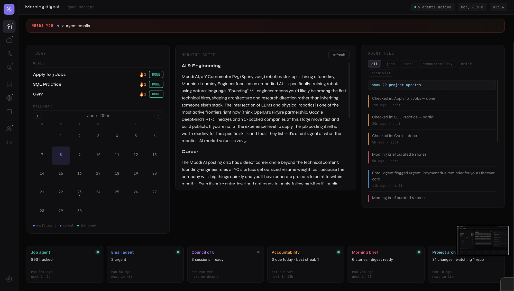
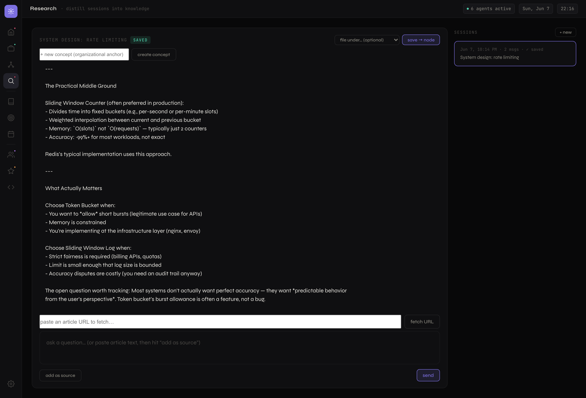
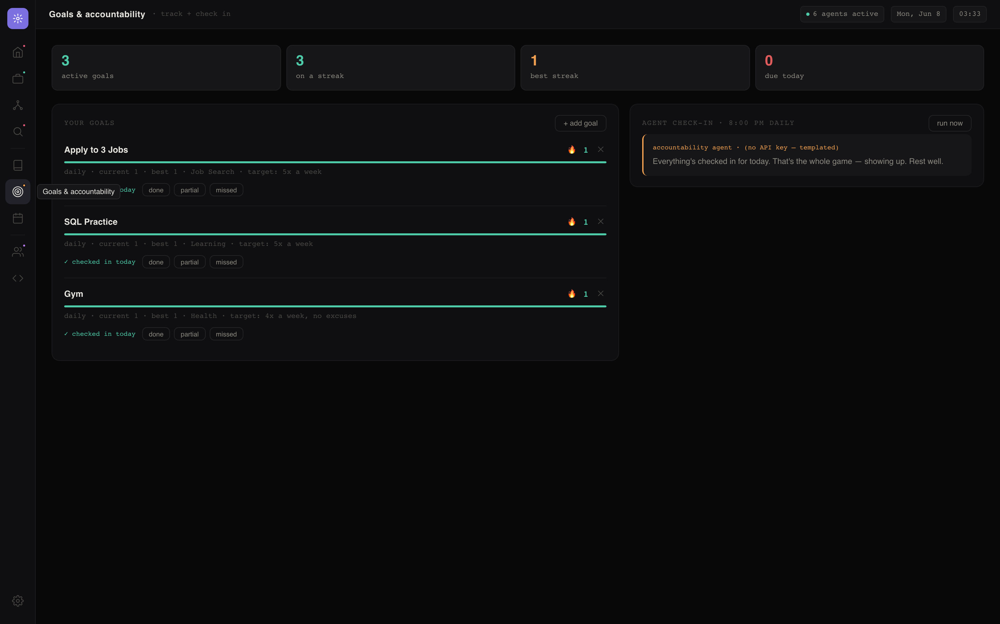
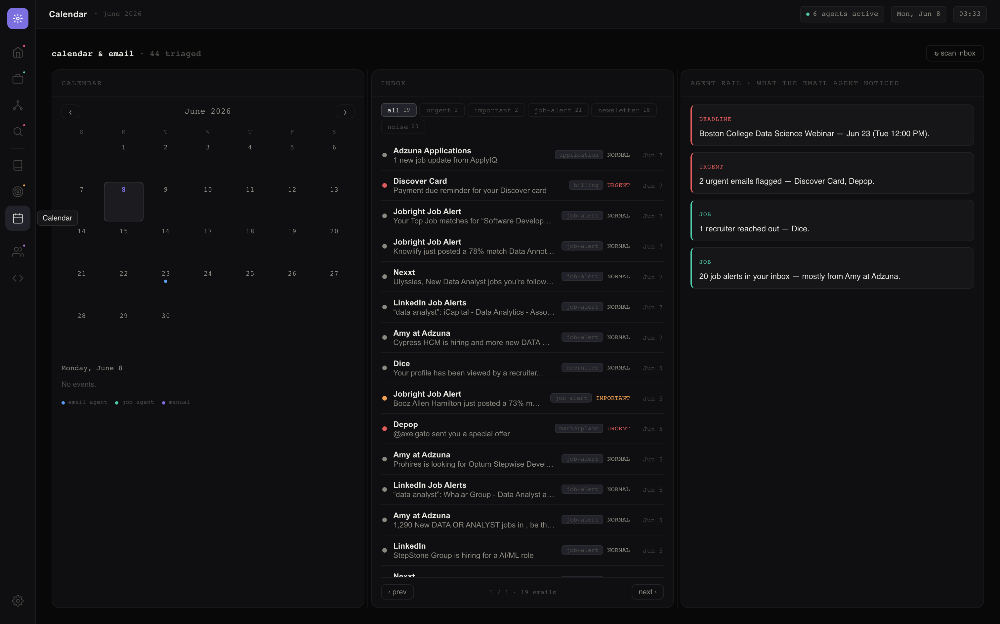
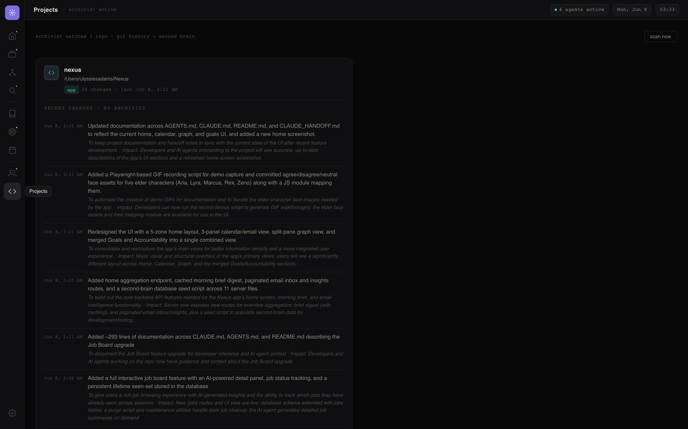
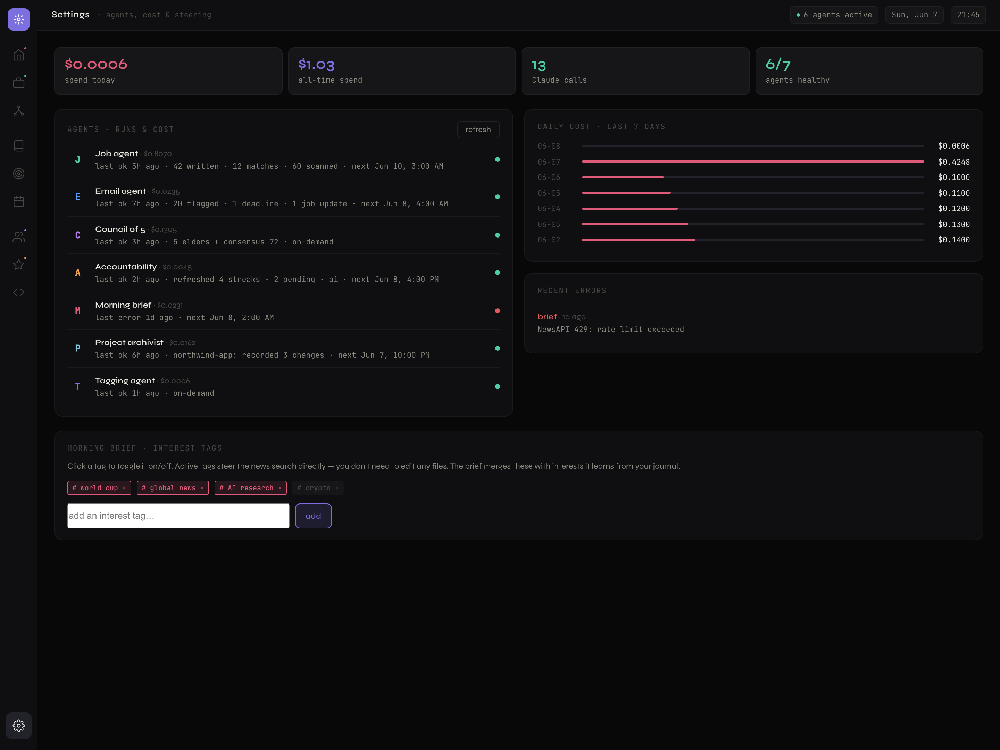

# Nexus

*A local-first personal AI operating system — specialized agents that share one memory.*

> **Nexus runs entirely on your machine.** A set of AI agents share one brain — a single SQLite file holding your notes, goals, journal, jobs, inbox, and projects — so each agent acts on what the others know. An interview email doesn't just get flagged; it moves your job application to "interviewing." A commit doesn't just get logged; it becomes a node in your knowledge graph.

The shared context **is** the product. Most AI assistants are a handful of disconnected chatbots; Nexus is a set of agents reading and writing the same memory.

### What it does

- **Command center** — one home dashboard: live stats, every agent's status, and a merged activity feed.
- **Job matching** — pulls live listings and ranks them against your résumé with Claude.
- **Inbox triage** (read-only) — flags what's urgent, pulls deadlines onto your calendar, and updates job statuses when a recruiter writes back.
- **Second brain** — journal, notes, and research are auto-tagged into a force-graph (shared tags = edges), with an optional concept hierarchy on top.
- **Research agent** — chat through a topic (paste articles, fetch URLs, ask questions), then distill the session into one permanent knowledge node.
- **Council of 5** — five AI personas debate your decisions, challenge each other, and land on a consensus.
- **Accountability** — tracks goals, keeps streaks, sends a nightly streak-aware nudge.
- **Morning brief** — curates a short daily news read from topics you pick and interests it learns from your notes.
- **Project archivist** — watches your repos and turns commits into plain-English memory and graph nodes.
- **Observability** — every agent run and Claude call is instrumented; a Settings panel shows run history, errors, next run, and estimated spend.

**Local-only by design.** Nexus runs on `localhost`, is never exposed publicly, and ships as a repo you clone and point at your own API keys. Filesystem and inbox access are exactly why it stays on your machine.

## The dashboard, screen by screen

One SPA with a left rail of tabs. Each tab is a window onto one or more agents writing to the shared `nexus.db` — so what you see in one screen is often the product of another agent's work.

> Screenshots use a mix of seeded demo data and live public job listings — not personal data.

### Home — the command center

The first screen you open each day, answering *what happened while I was away, what do I need to do today, and what is the system telling me* — from one `/api/home` call that aggregates across every agent, in five zones: an **alert strip** of only the time-sensitive items, **today's agenda** (goals with one-click check-in + a month-grid calendar widget), the **morning-brief digest** (4–6 topic-labeled sentences), a filterable **agent feed**, and an **agent health row** (status dot, last/next run, one insight line per agent).



### Job board — the job agent

Live listings from Adzuna / The Muse / Jobicy, scored 0–100 against your `.tex` résumés by Claude. Three subtabs:

- **Found by agent** — scored listings, newest-posted first, with a **new-this-scan** badge and a **★ Shortlist** of roles you've flagged *Interested*.
- **Live applications** — a status pipeline (applied → interviewing → offer) for what you're actively pursuing.
- **Inactive applications** — rejected / withdrawn / archived, plus **ghosted** (applied with no reply in 30 days).

Filter by track / level / status / city / match floor; sort by newest, match, or company (company folders appear only when sorting by company). Click any row for an inline panel: the listing description, why it's a fit (or not), missing skills, salary, posted date, and a link. **run now** triggers fetch → score → save on demand. **Cross-agent:** the email agent writes here — a recruiter's email flips a row to `interviewing`, and a job you applied to on LinkedIn gets created here straight from its confirmation email.


### Second brain — the knowledge graph

Every note (journal entry, research node, or archivist commit summary) is a **node**; two notes that share a tag get an **edge** — a force-directed graph you can pan, zoom, and click. On top of that flat associative web sits an optional **hierarchy**: *concept* anchors with directed parent→child edges. This is the memory the council and morning brief read from.


### Research — chat that becomes knowledge

Open a session and have a real conversation — paste articles, fetch URLs, ask follow-ups. The conversation is ephemeral; hit **save session** and the agent distills the whole thing into one structured node (topic, summary, key concepts as tags, conclusions, tracked open questions, sources). You can file it under a concept on save.



### Journal — free writing, auto-organized

Write a free-form entry and save. The **tagging agent** reads it and returns two to four topic tags, wiring the entry into the graph. You never file or categorize anything — the structure forms itself.


### Goals — what you're working toward

Goals with a cadence (daily / weekly), each showing a streak momentum bar, today's check-in controls (`done` / `partial` / `missed`), and the latest nudge from the accountability agent. Goal categories also feed the morning brief's interests.



### Calendar — email triage and deadlines (the email agent)

The read-only **email agent** scans Gmail (on a cron and on demand) and surfaces it two ways: **Upcoming** events including deadlines it extracted from emails, and a **triaged inbox** where each message gets an importance badge, a category, and a badge when it took a cross-agent action. All classification is one batched Claude call per run. Scope stays `gmail.readonly` — Nexus **never** sends or deletes.



### Council of 5 — perspective on demand

Ask about a decision or just rant. Five personas — **Marcus** (control), **Lyra** (long arc), **Zeno** (blind spots), **Aria** (emotional truth), **Rex** (next step) — answer in parallel, then each sees the others and declares a stance; a Haiku call scores consensus 0–100. They read your recent journal and goals as context, so advice is grounded in your actual life.


### Projects — the archivist

Per-repo cards with an AI-written change log. The **archivist** polls `git log` (and watches each repo's `.git/logs/HEAD`), summarizes each commit into `{summary, why, impact}`, and turns it into a **tagged second-brain node** — so project history connects to journal themes by shared tags. Filesystem reach is sandboxed to `WATCHED_PROJECTS`.



### Settings — observability, cost, and agent control

Agents run unattended, so the system is built to be observed and steered from one panel: **per-agent run history** (last/next run, trigger, success, one-line summary), **cost tracking** (token spend per agent and per day), an **error log**, and direct **agent controls** — edit the job agent's search locations, search terms, and résumés (DA/SWE), and pick the morning brief's news topics — all without touching a config file.



> Everything routes through one instrumented Claude client (`agents/claudeClient.js`): it brackets each run in an `agent_runs` row and logs tokens + estimated cost to `agent_usage`, best-effort so telemetry can never break an agent. `GET /api/observability` aggregates it in one query — LLM cost-and-reliability telemetry for a fleet of scheduled agents, at personal scale.

---

## Architecture

Two local processes, one shared database:

- **Frontend** — Vite + React 18 SPA on `localhost:5173`. A thin client over the REST API; never touches the DB or external APIs directly.
- **Backend** — one long-running Express process on `localhost:3001`. Hosts the API, every agent, all schedulers (`node-cron`), and file watchers. This runs 24/7.
- **Database** — SQLite (`better-sqlite3`), one file at `server/db/nexus.db`. The shared context every agent reads and writes.

```
                          ┌──────────────────────────┐
   Gmail (read-only) ───▶ │                          │ ───▶ Job board status flips
   Job boards ──────────▶ │      nexus.db            │ ───▶ Calendar deadlines
   Your journal/notes ──▶ │  (shared context layer)  │ ───▶ Second-brain graph
   Your goals ──────────▶ │                          │ ───▶ Morning brief interests
   Your git repos ──────▶ │   every agent r/w here   │ ───▶ Council & nudge context
                          └──────────────────────────┘
```

**How the agents work together (the whole point).** Because every agent shares `nexus.db`, work flows between them: a recruiter email flips `jobs.status` to `interviewing`; "due Friday" in an email becomes a calendar event; your journal tags teach the brief what to curate and ground the council's advice; each commit becomes a tagged graph node; and the home dashboard aggregates all of it. The frontend never touches the DB directly — the agents stay the single source of truth.

---

## Prerequisites

- **Node.js 18+** (the backend uses global `fetch`; tested on 20/22/24) and **npm**.
- An **Anthropic API key** (required for any agent that reasons), plus per-agent keys as you enable each (see [Configuration](#configuration)).

## Install

One project with the backend nested under `server/` — two `package.json` files.

```bash
npm install                       # frontend (repo root)
cd server && npm install && cd .. # backend
```

## Configuration

All secrets live in `server/.env` (gitignored). Copy the example and fill it in: `cp server/.env.example server/.env`.

| Variable | Needed for | How to get it |
|---|---|---|
| `ANTHROPIC_API_KEY` | **All agents** | [console.anthropic.com](https://console.anthropic.com) → API keys. ~$10–15/mo for personal use with prompt caching. |
| `ADZUNA_APP_ID` + `ADZUNA_APP_KEY` | **Job agent** | [developer.adzuna.com](https://developer.adzuna.com) → free tier (250 req/day). Muse + Jobicy need no key. |
| `EMAIL_USER` + `EMAIL_APP_PASSWORD` + `EMAIL_RECIPIENT` | Job report email (optional) | Gmail [app password](https://myaccount.google.com/apppasswords) (requires 2FA). Used by Nodemailer. |
| **Gmail OAuth** (`credentials.json`) | Email agent | Google Cloud → enable Gmail API → OAuth **Desktop** creds → `credentials.json` in `server/`. Then `cd server && npm run gmail:auth`. Scope stays `gmail.readonly`. |
| `NEWS_API_KEY` | Morning brief | [newsapi.org](https://newsapi.org) free dev tier. |
| `WATCHED_PROJECTS` | Archivist | Absolute local folder paths in `server/config.js`. Not a credential — sandboxed disk paths the watcher reads. |

For the Job board you only need `ANTHROPIC_API_KEY` and the two `ADZUNA_*` keys.

## Run

Two terminals; the backend must stay running for cron and watchers.

```bash
cd server && npm run dev   # backend, port 3001  (or: npm start)
npm run dev                # frontend, port 5173
```

Open **http://localhost:5173** — Vite proxies `/api` to the backend.

**Job board & résumés.** Click **run now** to fetch → score → save on demand (scheduled automation is off by default; flip `JOB_AGENT_CRON_ENABLED` in `config.js` to re-enable). Search locations, search terms, and the `.tex` résumés (in `server/resumes/`, gitignored) are editable from **Settings → Job agent** or in `config.js`.

**Maintenance scripts** (run from `server/`): `npm run purge:jobs` (drop untouched listings >30d, `-- --dry-run` to preview), `npm run migrate:jobs /path/to/jobs.json` (one-time legacy import), `npm run seed:brain` (`-- --reset`).

---

## The agents

| Agent | Status | What it does |
|---|---|---|
| **Job agent** | Live | Fetches + scores listings against your résumés, writes to `jobs`, tracks applications. Runs on the manual button (scheduled cron optional). |
| **Email agent** | Live | Reads Gmail (read-only), classifies importance, extracts deadlines to the calendar, and updates/creates `jobs` applications by matching companies. One-time `npm run gmail:auth`. |
| **Council of 5** | Live | Five personas answer in parallel, challenge each other, and a consensus score is computed. Reads journal + goals. |
| **Accountability** | Live | Tracks goals, maintains streaks, sends a nightly streak-aware nudge. |
| **Morning brief** | Live | Curates ~6–9 stories from your chosen news topics + interests learned from notes/goals. Needs `NEWS_API_KEY`. |
| **Project archivist** | Live | Summarizes each commit into `project_changes` + a tagged second-brain node. Sandboxed to `WATCHED_PROJECTS`. |
| **Tagging agent** | Live | Behind the scenes: auto-tags every new note, reusing existing tags so the graph stays connected. |
| **Research agent** | Live | Chat sessions that distill into one structured second-brain node (summary, concepts, conclusions, open questions, sources). |
| **Observability** | Live | The plumbing: instruments every run + Claude call into `agent_runs`/`agent_usage`, exposed via `GET /api/observability` and Settings. |

Every agent degrades gracefully without its key — the app never crashes; the affected feature just no-ops with a clear status.

## Project structure

```
nexus/                       # repo root = Vite + React frontend (port 5173)
├── master.html              # design source of truth (CSS variables + per-view markup)
├── src/
│   ├── main.jsx · App.jsx · index.css · api.js
│   └── views/               # one component per tab: Home, Jobs, Journal, Graph,
│                            #   Council, Goals, Calendar, Research, Projects, Settings
└── server/                  # nested Express package — agent host (port 3001)
    ├── index.js             # Express app + node-cron registration
    ├── config.js            # cities, search terms, résumés, schedules, WATCHED_PROJECTS
    ├── agents/              # jobAgent, emailAgent (+gmailAuth), councilAgent, accountabilityAgent,
    │                        #   morningBriefAgent, archivistAgent, tagAgent, researchAgent, claudeClient
    ├── db/                  # better-sqlite3 connection, schema.sql, one repo per domain
    ├── routes/              # jobs, notes, council, accountability, brief, email, calendar, overview, settings, …
    └── scripts/             # migrate-jobs, purge-stale-jobs, gmail-auth, seed-second-brain
```

See [`CLAUDE.md`](./CLAUDE.md) for the full file-by-file tree and architecture notes.

---

## Roadmap

> **This is the worst version of Nexus it will ever be.** The skeleton stands and every agent talks to the same brain; everything from here is making it sharper.

**Shipped** — scaffold + DB; job agent; journal + second brain (auto-tagging, force graph); Council of 5; email + accountability + morning brief (with cross-agent `jobs.status` flips); project archivist; home command center; observability & cost panel; research agent + hierarchical second brain.

**Next** —
- **Ask Nexus anything**: a query layer across your whole second brain; first test suites per layer; a prompt-cache cost audit.
- **Richer agents**: full calendar grid + recurring events; quantified goals + reminders; multi-source brief + TTS; email thread summaries + *draft* replies (never auto-send); résumé/cover-letter drafts; archivist file-save + release notes.
- **Proactivity**: agents that learn your preferences, proactive cross-agent nudges, a weekly self-review, per-task model routing.
- **New domains & reach**: finance / health / learning agents (same prompt + tables pattern); push notifications + responsive layout; one-command setup.
- **Hardening**: encryption at rest, backup/restore, a migrations framework, indexing/virtualization at scale.

The shared-context architecture lets any of these slot in without rewiring the rest, so the order follows whatever matters most in daily use.

---

## Notes

- **Local-only by design.** Never bind to a public interface. There's no deploy step — "running" means starting the two dev processes.
- **Single user, no app auth.** The only OAuth is Gmail read-only, used solely to read your inbox.
- **Don't commit** `server/.env`, `credentials.json`, or `server/db/nexus.db`.
- Architecture and conventions for AI coding tools live in [`CLAUDE.md`](./CLAUDE.md); the design system lives in `master.html` (ported into `src/index.css`).
