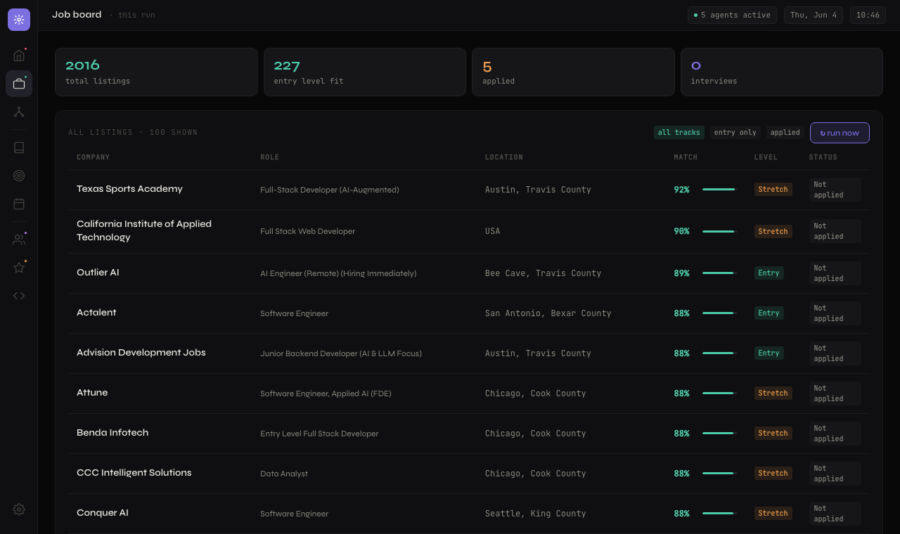
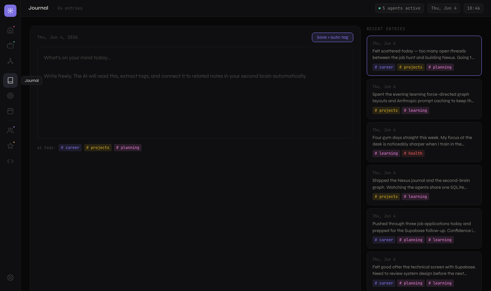
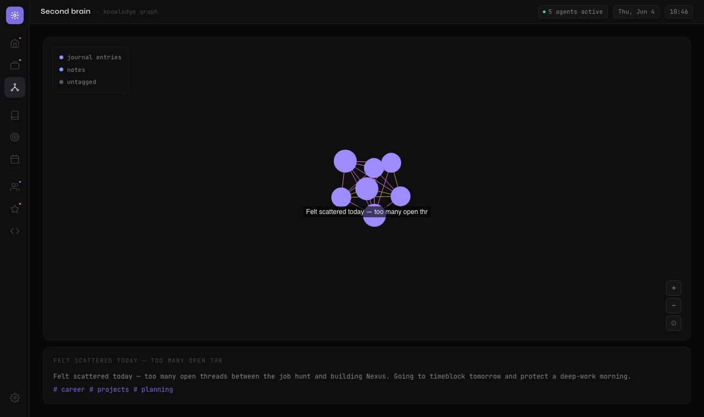
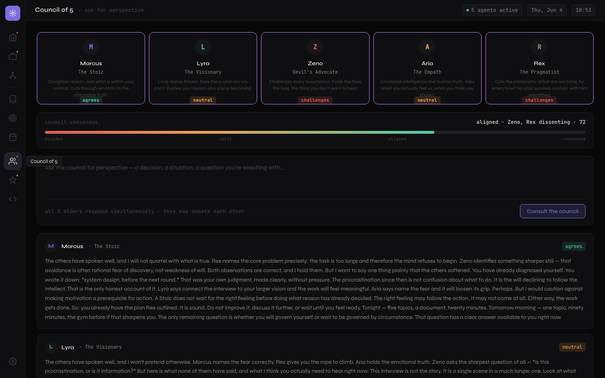

# Nexus

> A local-first personal AI operating system. Specialized AI agents (jobs, email, council, accountability, morning brief, project archivist) share one context layer — your notes, goals, journal, and projects — stored in a single SQLite file. The "second brain" isn't a feature; it's the nervous system the agents read from and write to.

Nexus runs **entirely on `localhost`** and is never exposed publicly. Filesystem and inbox access are exactly why it stays local-only. You run it by cloning this repo and configuring it with your own API keys.

**Status:** Phases 1–3 complete; Phase 4 (Council of 5) scaffolded and working — only the persona prompts remain to be refined. The Job board fetches live listings, scores them against your résumé with Claude, and renders from SQLite. The Journal saves free-form entries that an AI agent auto-tags, and the Second-brain graph links notes that share a tag. See [Roadmap](#roadmap).

## Screens

**Job board** — live listings scored against your résumé, sorted by match, with a manual "run now" trigger.



**Journal** — free-form entries; an AI agent tags each one on save.



**Second brain** — every note is a node; a shared tag is an edge. Click a node to preview it.



**Council of 5** — five personas answer in parallel, challenge each other, and land on a consensus score (persona prompts are starter text you refine in your own voice).



---

## Architecture

Two processes on one machine, both local:

- **Frontend** — Vite + React 18 SPA on `http://localhost:5173`. A thin client that calls the backend's REST API; it never touches the database or external APIs directly.
- **Backend** — a single long-running Express process on `http://localhost:3001`. Hosts the REST API, every agent, all schedulers (`node-cron`), and file watchers. This is the piece that runs 24/7.
- **Database** — SQLite (`better-sqlite3`), one file at `server/db/nexus.db`. The shared context layer every agent reads and writes.

```
Gmail inbox   -> Email agent     -> SQLite -> updates Job agent statuses
Job boards    -> Job agent       -> match scoring -> 3-day email report
Notes + goals -> SQLite context  -> Council + Accountability read it
Code repos    -> Archivist watch -> SQLite + graph nodes
```

Cross-agent writes are the point: an "interview" email can flip a `jobs.status`; the archivist's summaries become second-brain graph nodes.

---

## Prerequisites

- **Node.js 18+** (the backend uses the global `fetch`; tested on Node 20/22/24).
- **npm**.
- An **Anthropic API key** (required for any agent that reasons).
- Per-agent API keys as you enable each agent (see [Configuration](#configuration)).

---

## Install

The repo is one project with the backend nested under `server/` — two `package.json` files.

```bash
# from the repo root (the frontend)
npm install

# the backend
cd server && npm install && cd ..
```

---

## Configuration

All secrets live in `server/.env` (gitignored — never commit it). Copy the example and fill it in:

```bash
cp server/.env.example server/.env
```

What each value is and how to get it:

| Variable | Needed for | How to get it |
|---|---|---|
| `ANTHROPIC_API_KEY` | **All agents** (required now) | [console.anthropic.com](https://console.anthropic.com) → API keys → Create key. Add billing. ~$10–15/mo for personal daily use with prompt caching. |
| `ADZUNA_APP_ID` + `ADZUNA_APP_KEY` | **Job agent** (required now) | [developer.adzuna.com](https://developer.adzuna.com) → register → free tier (250 req/day). The Muse + Jobicy need no key. |
| `EMAIL_USER` + `EMAIL_APP_PASSWORD` + `EMAIL_RECIPIENT` | **Job report email** (optional — the run still works without it) | Gmail → [myaccount.google.com/apppasswords](https://myaccount.google.com/apppasswords) → generate a 16-char app password (requires 2FA). Used by Nodemailer to send the digest. |
| **Gmail OAuth** (`credentials.json`) | Email agent (Phase 5) | Google Cloud Console → new project → enable Gmail API → OAuth consent screen (External, add yourself as a test user) → create **OAuth Desktop** credentials → download `credentials.json` into `server/`. First run authorizes in a browser; the token caches locally. Scope stays `gmail.readonly` — the agent never sends or deletes. |
| `NEWS_API_KEY` | Morning brief agent (Phase 5) | [newsapi.org](https://newsapi.org) free dev tier (or GNews/Currents). |
| `WATCHED_PROJECTS` | Project archivist (Phase 6) | Absolute local folder paths in `server/config.js`, e.g. `[{ name, path, type }]`. Not a credential — disk paths the watcher reads. Sandboxed to these paths only. |

For Phase 2 (the Job board) you only need `ANTHROPIC_API_KEY` and the two `ADZUNA_*` keys; email is optional.

---

## Run

Start both processes (two terminals). The backend must stay running for cron and watchers.

```bash
# terminal 1 — backend (port 3001)
cd server && npm run dev      # or: npm start

# terminal 2 — frontend (port 5173)
npm run dev
```

Open **http://localhost:5173**. The Vite dev server proxies `/api` to the backend, so the browser talks to one origin.

### Using the Job board

- The board renders live from SQLite, sorted by match score, with filters (all tracks / entry only / applied).
- **`↻ run now`** triggers the full pipeline on demand: fetch live listings (Adzuna/Jobicy/The Muse) → score against your résumé with Claude → write to SQLite → optional email digest. The button polls progress and the board refreshes when the run finishes.
- The same pipeline runs automatically on a **`node-cron` schedule (`0 7 */3 * *`** — 07:00 every 3rd day), registered when the backend boots. Each scheduled run also purges unapplied listings older than 30 days.

### Résumés and search settings

Search terms, target cities, scoring thresholds, the cron schedule, and résumé paths live in **`server/config.js`**. The scorer compares listings against the `.tex` résumés in `server/resumes/` (DA and SWE tracks) — **add your own there; they're gitignored so personal résumés never get committed.** Edit `config.js` to change what gets searched and which résumé scores each track.

### Maintenance scripts (run from `server/`)

```bash
npm run purge:jobs                 # delete unapplied jobs older than 30 days
npm run purge:jobs -- --dry-run    # preview the purge
npm run migrate:jobs /path/to/jobs.json   # one-time import of a legacy job-agent jobs.json
```

---

## The agents

| Agent | Status | What it does |
|---|---|---|
| **Job agent** | ✅ working (Phase 2) | Fetches + scores listings, writes to `jobs`, sends a 3-day email report. Runs on cron + the manual button. |
| **Email agent** | planned (Phase 5) | Reads Gmail (read-only), classifies importance, extracts deadlines, and auto-updates `jobs.status` by matching companies. |
| **Council of 5** | ✅ working (Phase 4) | Five personas (Marcus/Lyra/Zeno/Aria/Rex) answer in parallel, challenge each other, and a consensus score is computed. Reads journal + goals. Persona prompts are starter text to refine. |
| **Accountability** | planned (Phase 5) | Tracks goals, maintains streaks, sends scheduled check-ins and honest nudges. |
| **Morning brief** | planned (Phase 5) | Curates ~5 articles matched to your interests into a 10-minute morning read. |
| **Project archivist** | planned (Phase 6) | Watches your code dirs, summarizes commits/diffs with Claude into `project_changes` + graph nodes. Sandboxed to `WATCHED_PROJECTS`. |

---

## Project structure

```
nexus/                       # repo root = Vite + React frontend (port 5173)
├── master.html              # design source of truth (CSS variables + per-view markup)
├── index.html · vite.config.js · package.json
├── src/
│   ├── main.jsx · App.jsx · index.css · api.js
│   └── views/JobsView.jsx   # the live Job board
└── server/                  # nested Express package — agent host (port 3001)
    ├── index.js             # Express app + cron registration on boot
    ├── config.js            # agent settings: cities, search terms, résumé paths, schedule
    ├── resumes/             # .tex résumés the scorer compares against
    ├── agents/jobAgent.js   # the absorbed fetch → score → save → email pipeline
    ├── db/                  # better-sqlite3 connection, schema, jobsRepo, maintenance
    ├── routes/jobs.js       # job board + run API
    └── scripts/             # migrate-jobs, purge-stale-jobs
```

---

## Roadmap

1. **Scaffold + DB** ✅ — frontend, server, SQLite schema, design ported.
2. **Job agent** ✅ — pipeline absorbed, cron wired, run button, board live.
3. **Journal + second brain** ✅ — journal with AI auto-tagging, notes in SQLite, force graph.
4. **Council of 5** 🟡 — personas, challenge pass, consensus meter (Sonnet 4.6; cost-first). Plumbing + view done; persona prompts are starter text to refine. *(current)*
5. **Email + accountability + morning brief** — Gmail, cross-agent status updates, goals, curation.
6. **Project archivist** — git watcher, AI change summaries, graph integration.

---

## Notes

- **Local-only by design.** Never bind to a public interface. There is no deploy step — "running" means starting the two dev processes above.
- **Single user, no app auth.** The only OAuth is Gmail read-only, used solely to read your inbox.
- **Don't commit** `server/.env`, `credentials.json`, or `server/db/nexus.db`.
- Architecture and build conventions for AI coding tools live in [`CLAUDE.md`](./CLAUDE.md); the design system lives in `master.html` (ported into `src/index.css`).
```
